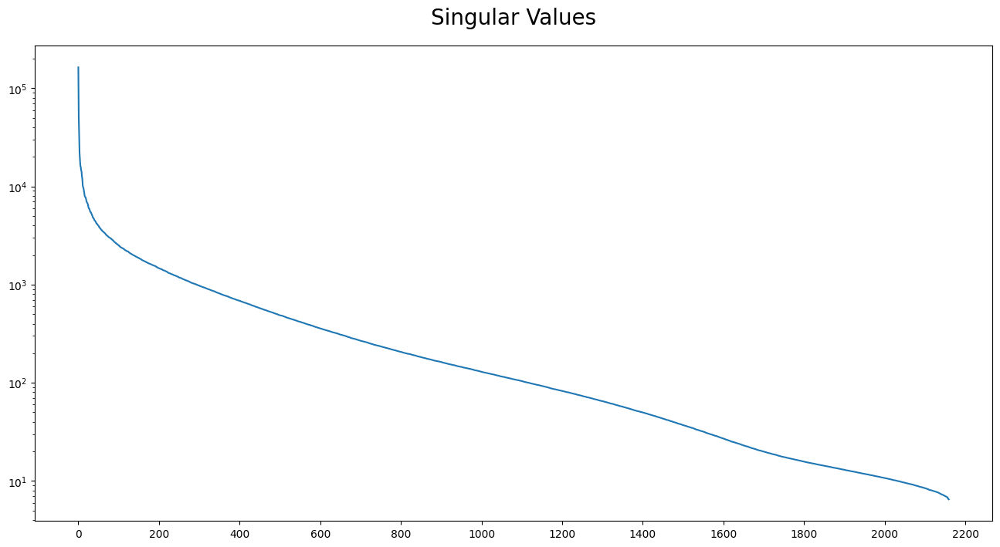

[`Singular Value Decomposition`](https://www.youtube.com/watch?v=CpD9XlTu3ys)

[`Singular Value Decomposition per Image Compression`](http://timbaumann.info/svd-image-compression-demo/)

Il primo grafico del `Jupyter Notebook` mostra come, in questo specifico esempio, i singular values contenenti più informazioni siano concentrati nei primi 100/200 valori.

Il secondo grafico ci conferma che con i primi singular values possiamo ottenere circa il 75% delle informazione dell' immagine presa in considerazione.
